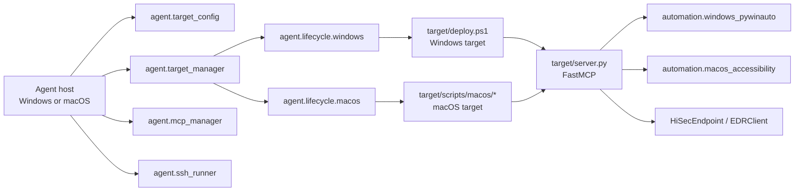

# EDR-WD

EDR-WD is split into two orthogonal layers:

- Agent side: configuration, lifecycle, SSH/SCP, MCP session management
- Target side: the actual FastMCP server, GUI backend, and OS-specific launch
  strategy

The agent OS can be Windows or macOS. The target OS can be Windows or macOS.
The same Python orchestration APIs are used on both agent platforms; the shell
wrapper `agent/edr-wd.sh` is just a POSIX convenience entrypoint.

## Repository Layout

Use these directories by responsibility:

- `agent/`: agent-side orchestration only. It loads target config, handles
  SSH/SFTP, selects lifecycle backends, and initializes MCP sessions.
- `agent/lifecycle/`: target lifecycle adapters. These call target scripts
  remotely; they should not contain GUI automation logic.
- `target/`: files copied to or run on the target machine. `target/server.py`
  is the FastMCP server.
- `target/automation/`: GUI automation backend implementations. Target OS
  decides which backend is active.
- `target/scripts/`: target-local startup, stop, health, and installer scripts.
- `test_case/`: profile-dispatched test entrypoints and pytest coverage.
- `scripts/`: developer utilities that are not runtime entrypoints.
- `docs/architecture/` and `references/`: architecture notes and operation
  references.

Generated files must stay out of Git: `.venv/`, `__pycache__/`, `.pytest_cache/`,
`*.log`, `target/logs/`, `.DS_Store`, and local target configs.

## Architecture



## Configuration

Runtime targets live in `config/targets.local.json` and are loaded by
`agent.target_config.TargetConfig`.

For the current intranet SSH workflow, put the target username and password
directly in the target's `ssh` block:

```json
"ssh": {
  "host": "<TARGET_IP>",
  "port": 22,
  "user": "<TARGET_USER>",
  "auth": {
    "type": "password",
    "password": "<TARGET_PASSWORD>"
  }
}
```

Password auth is the preferred path for both Windows and macOS targets.
`password_env` and key auth remain compatibility options, but they are not
required for the current workflow. TODO: revisit secret storage when this moves
outside the trusted intranet setup. Never commit `config/targets.local.json` or
paste real IPs, usernames, passwords, or target paths in logs, commits, PRs, or
chat.

Key fields:

- `platform`: `windows` or `macos`
- `app_profile`: optional, used by the test dispatcher
- `ssh`: host/user/auth
- `mcp`: host/port/path/connect_mode/tunnel
- `windows` or `macos`: platform-specific launch config

Useful commands:

```bash
python -m agent.target_config --init
python -m agent.target_config --validate
python -m agent.target_config --list
python -m agent.target_config --guide
```

## Agent Side Workflow

The agent-side control flow is always the same, regardless of the agent OS:

1. `target_manager.ensure_server_running(name)` checks TCP reachability and
   starts the target server through the platform lifecycle backend if needed.
2. `mcp_manager.initialize(name)` performs MCP initialize and returns a
   session id plus the MCP URL.
3. `mcp_manager.call_mcp_tool(...)` sends tool calls over the active session.

Example:

```python
from agent.target_manager import ensure_server_running
from agent.mcp_manager import initialize, call_mcp_tool

ensure_server_running("win-dev")
init = initialize("win-dev")
mcp_url = init["data"]["mcp_url"]
session_id = init["data"]["session_id"]
print(call_mcp_tool(session_id, mcp_url, "status"))
```

### Convenience wrapper

On macOS/Linux agents you can use the bundled wrapper:

```bash
bash agent/edr-wd.sh up
bash agent/edr-wd.sh status
bash agent/edr-wd.sh smoke --gui
bash agent/edr-wd.sh down
```

`agent/edr-wd.sh` is a thin shell wrapper around the same Python APIs. On
Windows agents, use [agent/deploy.ps1](agent/deploy.ps1) for the same control
plane, including config guidance, deploy/install, `up/down/status`, `push`,
and `smoke`.

## Target Lifecycle

### Windows targets

Windows lifecycle is handled by `agent/lifecycle/windows.py` and the scripts in
`target/`:

- [target/deploy.ps1](target/deploy.ps1) is the operator-facing lifecycle entrypoint
- `target/scripts/install_task.ps1` registers the scheduled task
- `target/scripts/start_server.ps1` starts the server in the interactive
  desktop session
- `target/scripts/stop_server.ps1` stops the listener on port 8765
- `target/scripts/health.ps1` performs a quick port-level health check

Typical Windows flow — all via `agent/lifecycle/windows.py` through
`target_manager.ensure_server_running()` and `target_manager.stop_server()`.

### macOS targets

macOS lifecycle is handled by `agent/lifecycle/macos.py` and the scripts under
`target/scripts/macos/`:

- `install_launch_agent.sh` registers a LaunchAgent
- `start_server.sh` starts the FastMCP server in the GUI session
- `stop_server.sh` stops the server by port/pidfile
- `com.edr-wd.target.plist.template` is rendered during install

The macOS backend is intentionally narrower than the Windows backend:

- `dump_tree` / control_id workflows are Windows-first
- macOS uses Accessibility/System Events plus app/window detection
- `activate_edr` on macOS targets the `EDRClient` application window. It first
  tries
  `/Applications/HiSecEndpoint.app/Contents/script/root_start_client.sh` via
  non-interactive sudo and only accepts success when an `EDRClient` window is
  detected. If sudo/script startup fails, it opens `HiSecEndpointAgent` as the
  fallback entry window and uses the Swift Accessibility helper to click
  "前往安全防护中心".

## MCP Server

`target/server.py` is the cross-platform FastMCP server. The backend is chosen
by `EDR_WD_AUTOMATION_BACKEND`:

- `windows_pywinauto`
- `macos_accessibility`

Primary tools:

- GUI: `connect`, `dump_tree`, `click`, `click_target`, `click_at`,
  `click_window_at`, `type_text`, `select`, `get_text`, `screenshot`,
  `restore_edr`
- Window/app: `activate_app`, `list_windows`, `is_window_open`, `wait_window`,
  `activate_edr`, `status`
- PowerShell: `run_powershell`, `start_powershell`, `get_job`, `cancel_job`
- Debug: `diagnose_windows`

PowerShell tools require `EDR_WD_ENABLE_POWERSHELL=1` on the target server.

## Testing

Smoke test the live server:

```bash
python target/tests/smoke_mcp_client.py --base-url http://127.0.0.1:8765/mcp
python target/tests/smoke_mcp_client.py --base-url http://127.0.0.1:8765/mcp --gui
```

The smoke client is backend-aware:
- Windows backends exercise `run_powershell`, async jobs, `connect`, and `dump_tree`
- macOS backends exercise `list_windows`, `activate_app`, and Finder-based GUI plumbing
- `status` is backend-aware; macOS-only window diagnostics stay on the macOS backend
- `status.backend_kind` is the stable backend selector (`windows_pywinauto` / `macos_accessibility`)
- `status.host` / `status.port` report the actual runtime bind address, not a hard-coded 8765
- `restore_edr` is connect-required and returns a structured window payload when the
  backend exposes a connected app instance; the regression tests now verify the
  returned `rectangle` fields as part of the workflow
- macOS HiSec profile treats `screenshot` as a permission-gated diagnostic: a
  successful file-only capture without inline image payload is skipped rather
  than failed, and the final post-restore visibility check is diagnostic-only
  because `restore_edr` is non-destructive on macOS
- Windows GUI smoke/E2E coverage opens `HisecEndpointAgent.exe` first, then
  `EDRClient.exe`, and verifies both desktop windows with `wait_window` /
  `is_window_open`. The same window-pair E2E is part of the basic pytest
  integration suite in `test_case/test_integration/test_edr_window_pair_e2e.py`.

Full profile-dispatched tests:

```bash
python test_case/run_tests.py --target win-dev
python test_case/run_tests.py --target mac-dev
```

If you need low-level config validation:

```bash
python -m agent.target_config --validate
python -m agent.target_config --list
python -m agent.target_config --guide
```

## Important Notes

- The target server must run in a logged-on interactive desktop session.
- A pure SSH background session is not sufficient for GUI automation.
- `target_manager.ensure_server_running()` only guarantees TCP readiness;
  `mcp_manager.initialize()` is what makes the MCP session usable.
- The agent OS is orthogonal to the target OS: the same Python orchestration
  modules work on Windows and macOS agents.
- Protocol version for the current agent/test clients is `2025-03-26`.

## Useful Files

Primary agent entrypoints:

- [agent/deploy.ps1](agent/deploy.ps1): Windows-shell control plane.
- [agent/edr-wd.sh](agent/edr-wd.sh): POSIX convenience wrapper.
- [agent/target_config.py](agent/target_config.py): config validation,
  initialization, and target lookup.
- [agent/target_manager.py](agent/target_manager.py): deploy/install/start/stop
  orchestration.
- [agent/mcp_manager.py](agent/mcp_manager.py): MCP initialize and tool calls.

Lifecycle and transport:

- [agent/lifecycle/base.py](agent/lifecycle/base.py): lifecycle backend contract.
- [agent/lifecycle/windows.py](agent/lifecycle/windows.py): Windows target lifecycle.
- [agent/lifecycle/macos.py](agent/lifecycle/macos.py): macOS target lifecycle.
- [agent/ssh_runner.py](agent/ssh_runner.py): SSH/SFTP execution abstraction.

Target runtime:

- [target/server.py](target/server.py): cross-platform FastMCP server.
- [target/deploy.ps1](target/deploy.ps1): target-side Windows lifecycle wrapper.
- [target/automation/base.py](target/automation/base.py): automation backend contract.
- [target/automation/windows_pywinauto.py](target/automation/windows_pywinauto.py):
  Windows UIA backend.
- [target/automation/macos_accessibility.py](target/automation/macos_accessibility.py):
  macOS Accessibility backend.
- [target/scripts/](target/scripts): target-local start/stop/health/install scripts.

Testing and diagnostics:

- [target/tests/smoke_mcp_client.py](target/tests/smoke_mcp_client.py): live MCP smoke client.
- [test_case/run_tests.py](test_case/run_tests.py): profile-dispatched test runner.
- [test_case/run_windows_hisec.py](test_case/run_windows_hisec.py): Windows HiSec flow.
- [test_case/run_macos_generic.py](test_case/run_macos_generic.py): macOS generic flow.
- [scripts/redact_config.py](scripts/redact_config.py): safe local config inspection.

Compatibility helpers:

- [agent/tunnel.sh](agent/tunnel.sh): legacy/manual SSH tunnel helper.
- [agent/setup-mac.sh](agent/setup-mac.sh): one-off macOS SSH config helper.

Avoid treating generated files as project structure. If you see `.venv/`,
`__pycache__/`, `.pytest_cache/`, `target/logs/`, root `*.log`, or `.DS_Store`,
delete them locally; they are runtime artifacts.

## Troubleshooting

- Empty `dump_tree` usually means the server was not started in an interactive
  desktop session.
- If `mcp_manager.initialize()` fails, check the MCP URL, port forwarding, and
  protocol version.
- On macOS, Accessibility / Screen Recording permissions are required for
  backend features that enumerate or capture windows.
- On Windows, `EDR_WD_ENABLE_POWERSHELL=1` must be set for PowerShell tools
  and HiSec activation.
- On Windows, use `agent/deploy.ps1 -Action config-guide` to generate a concise setup walkthrough.
